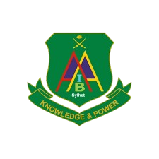

# Army Institute of Business Administration (AIBA) - Website Prototype

> ⚠️ **DISCLAIMER**: This is a **frontend prototype** for demonstration purposes only. All data, names, contact information, and content displayed are **dummy/placeholder data** and do not represent real information.



## 🎯 Project Overview

This is a comprehensive frontend prototype for the Army Institute of Business Administration (AIBA) website, built with modern web technologies. The project showcases a complete university website structure with multiple sections and interactive features.

### Key Features

- 🏠 **Home Page** - Hero section, announcements, news, and institute overview
- 📚 **About Section** - History, Vision & Mission, FAQ, Partnerships, Gallery
- 👔 **Administration** - Chairman, Director, Additional Director, Governing Body, Office
- 🎓 **Academics** - Programs (BBA/MBA), Courses, Key Disciplines, Faculties, Calendar, Notices
- 📝 **Admission** - Undergraduate, Graduate, Eligibility, Scholarships, Financial Aid, Application
- 🔬 **Research** - Faculty Research, Student Research
- 📰 **Publication** - Journal, Magazine, Newsletter
- 🔧 **Utility** - Webmail, Student Clubs, Career, Degree Verification, Certificate Attestation, NOC

### Portal Systems (Demo/Simulation)

Interactive portal demonstrations with simulated functionality:

- 🎒 **Student Portal** - Dashboard, Courses, Results, Attendance, Fees, Library
- 👨‍🏫 **Faculty Portal** - Dashboard, Attendance Marking, Grade Submission, Course Materials
- 🛡️ **Admin Portal** - User Management, Result Input, Reports, System Settings
- 📋 **Admission Portal** - Online Application, Payment Gateway, Admit Card, Seat Plan, Results

## 🛠️ Tech Stack

| Technology | Purpose |
|------------|---------|
| **React 19** | Frontend Framework |
| **Vite 7** | Build Tool & Dev Server |
| **Tailwind CSS 4** | Styling (CSS-first configuration) |
| **React Router DOM** | Client-side Routing |
| **Framer Motion** | Animations |
| **Lucide React** | Icon Library |

## 🎨 Design System

### Color Palette

| Color | Hex | Usage |
|-------|-----|-------|
| Army Dark | `#3C4E3B` | Primary backgrounds, navbar |
| Sage Deep | `#7A8F79` | Accents, buttons |
| Navy | `#1E3A5F` | Text, headers |
| Soft Gold | `#BBA766` | Highlights, CTAs |
| Off White | `#FAF9F6` | Page backgrounds |

## 📁 Project Structure

```
AIBA-mvp/
├── public/                    # Static assets
├── src/
│   ├── assets/               # Images and media
│   ├── components/
│   │   ├── common/           # Reusable components (PageHeader)
│   │   └── layout/           # Layout components (Header, Footer, Layout)
│   ├── pages/
│   │   ├── about/            # About section pages
│   │   ├── academics/        # Academic pages
│   │   ├── administration/   # Administration pages
│   │   ├── admission/        # Admission pages
│   │   ├── portals/          # Portal systems (Student, Faculty, Admin, Admission)
│   │   ├── publication/      # Publication pages
│   │   ├── research/         # Research pages
│   │   └── utility/          # Utility pages
│   ├── App.jsx               # Main app with routing
│   ├── main.jsx              # Entry point
│   └── index.css             # Global styles & Tailwind config
├── package.json
├── vite.config.js
├── tailwind.config.js
└── README.md
```

## 🚀 Getting Started

### Prerequisites

- Node.js 18+ 
- npm or yarn

### Installation

```bash
# Clone the repository
git clone https://github.com/syeed-mahmud/AIBA-mvp.git

# Navigate to project directory
cd AIBA-mvp

# Install dependencies
npm install

# Start development server
npm run dev
```

### Build for Production

```bash
npm run build
```

The production build will be generated in the `dist/` folder.

## 📱 Responsive Design

The website is fully responsive and optimized for:
- 📱 Mobile devices (320px+)
- 📱 Tablets (768px+)
- 💻 Laptops (1024px+)
- 🖥️ Desktops (1280px+)

## 🔐 Demo Credentials

For portal demonstrations, use these credentials:

| Portal | Email | Password |
|--------|-------|----------|
| Student | student@aiba.edu.bd | demo123 |
| Faculty | faculty@aiba.edu.bd | demo123 |
| Admin | admin@aiba.edu.bd | admin123 |
| Admission | (No login required) | - |

## ⚠️ Important Notes

1. **Prototype Only**: This is a frontend prototype without backend integration
2. **Dummy Data**: All displayed information is placeholder content
3. **No Real Authentication**: Login systems are simulated for demonstration
4. **No Database**: Data is hardcoded in React components
5. **Payment Simulation**: Payment gateways are visual mockups only

## 📄 Pages Overview

### Public Pages (22+)
- Home, Contact
- About (5 pages): History, Vision, FAQ, Partnerships, Gallery
- Administration (5 pages): Chairman, Director, Additional Director, Governing Body, Office
- Academics (7 pages): Programs, Courses, Key Disciplines, Faculties, Affiliation, Calendar, Notices
- Admission (8 pages): Info, Undergraduate, Graduate, Eligibility, Scholarships, Financial, FAQ, Notices
- Research (2 pages): Faculty Research, Student Research
- Publication (3 pages): Journal, Magazine, Newsletter
- Utility (6 pages): Webmail, Career, Student Clubs, NOC, Degree Verification, Certificate Attestation

### Portal Systems (4)
- Student Portal (7 sections)
- Faculty Portal (6 sections)
- Admin Portal (5 sections)
- Admission Portal (6 sections)

## 🤝 Contributing

This is a prototype project. For suggestions or improvements, please open an issue or submit a pull request.

## 📜 License

This project is for educational and demonstration purposes.

---

**Developed as a frontend prototype demonstration**

*All data, names, and information are fictional and for demonstration purposes only.*
